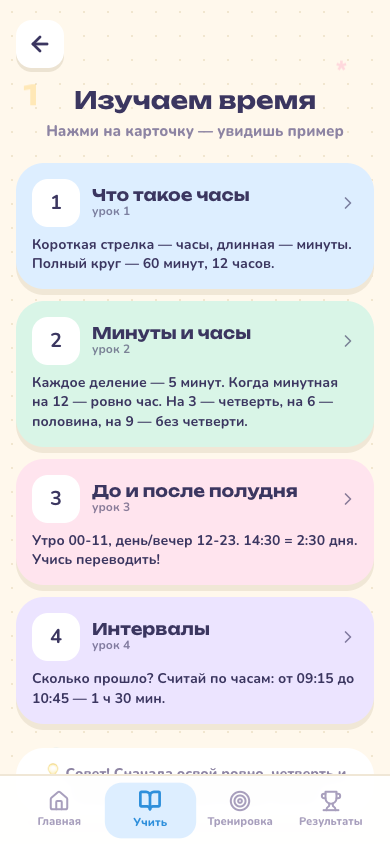
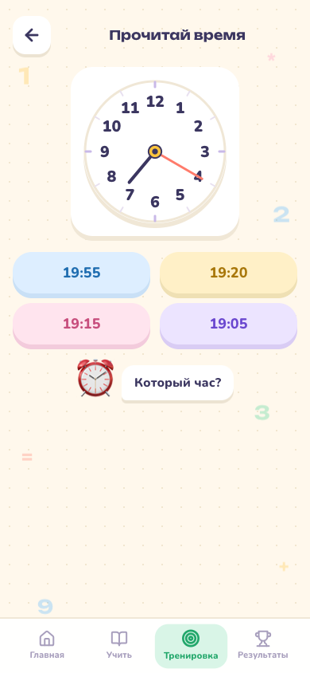
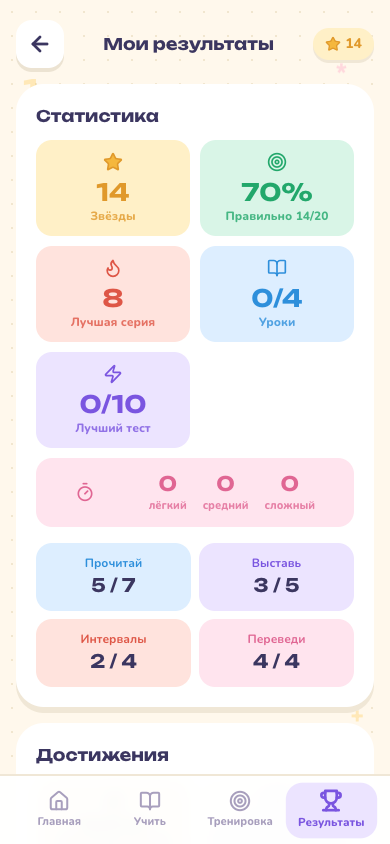

# ⏰ Часики — учим время

Весёлое приложение, которое помогает детям научиться определять время по часам играючи. Аналоговые и цифровые часы, интервалы и переводы — яркие экраны, дружелюбный маскот и награды превращают учёбу в игру. 🎉

## ✨ Что внутри

- 📚 **Изучаем время** — 4 урока шаг за шагом: устройство часов, четверти и половина, AM/PM, интервалы
- 🕐 **Прочитай время** — аналоговые часы → выбери `9:00` (вперемешку, сложность подстраивается сама)
- 🕑 **Выставь стрелки** — дано `9:00` → выбери правильные часы (вперемешку: `10:00, 15:00, 16:30` и т.д.)
- ⏳ **Сколько прошло?** — два циферблата → сколько длилось (например `1 ч 30 мин`)
- 🔄 **Переведи время** — часы ↔ минуты, минуты до следующего часа
- ⚡ **Быстрый тест** — 10 случайных вопросов, микс из всех тем
- ⏱️ **На время** — сколько успеешь за 60/45 сек
- 🏆 **Достижения + рекорды** — значки, звёзды, серия и прогресс по всем играм
- 🔊 **Звуки** — озвучка ответов/достижений и тихий фон (🔊/🔇 в Результатах)
- 📱 **PWA** — добавь на главный экран и учи без интернета

## 🌐 Живой пример

Готовая версия уже живёт здесь:

[](https://urtaevs.github.io/clock-kids/)

## 🖼️ Скриншоты (мобильный вид)

<div align="center">
  
  
  
  
</div>
<p align="center"><sub>Главная · Изучаем время · Тренировка · Результаты</sub></p>

## 🚀 Быстрый старт

```bash
npm install
npm run dev
```

Открой **http://localhost:5173** — и вперёд! 💛

Сборка для продакшена:

```bash
npm run build      # собирает в папку dist/
npm run preview    # предпросмотр собранной версии
```

## 🤖 Android (APK)

Готовый `.apk` для установки на телефон скачивай в **Releases**:

[](https://github.com/urtaevS/clock-kids/releases/latest)

Скачай файл и разреши установку из неизвестных источников на телефоне. 🤖

## 🛠 Технологии

React · TypeScript · Vite · Tailwind CSS · vite-plugin-pwa · Capacitor · Preferences (сохранение прогресса) · Web Audio (звуки)

---

Сделано с заботой, чтобы учёба была радостью. 🌟
